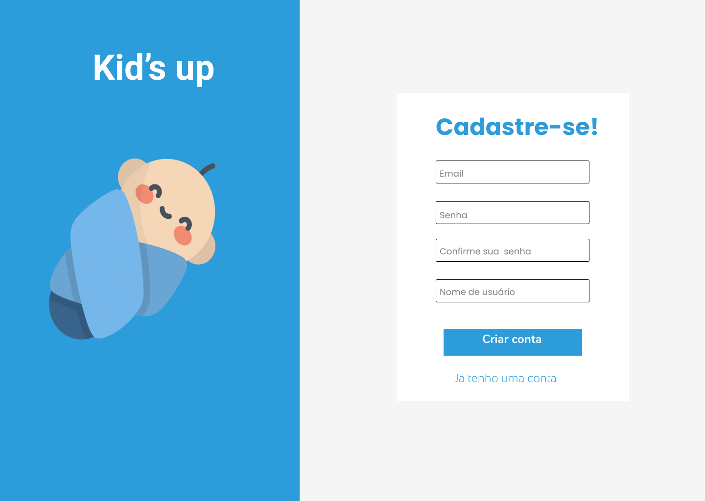
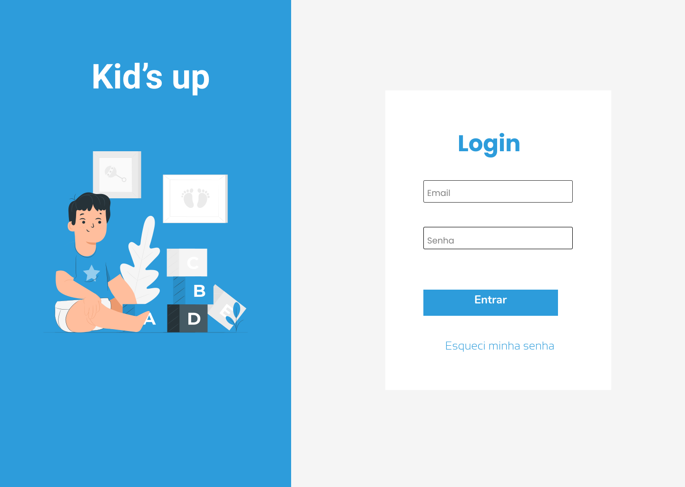

 
 

 # Kids Up Web
 ### Kids Up is an app that facilitates the communication of parents and caregivers in a day care center

 ## 💻 Preview

  
  
  

 ## 👨‍💻 This project was developed with the following technologies:
 
 
 
 
 
 
 
 
 

 ## 🔖 Layout

- This project was developed using [Figma](https://www.figma.com/) 

 

## Installation

### GIT

- Install git on your machine: https://git-scm.com/downloads
- With git installed on your machine, clone the repository using the **Code** button at https://github.com/Mateus-Kent/kids-up-web

### NodeJS

- Download the LTS version of the node at https://nodejs.org/en/
- To test whether node is installed on your machine, run the following `node -v` command. The NodeJS version should appear

### Installing the packages

- Inside the project folder, run the following command: `npm i`

## Now just run the project

 

 
